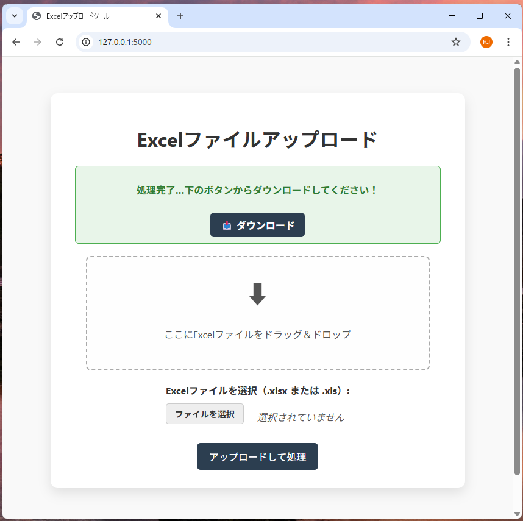
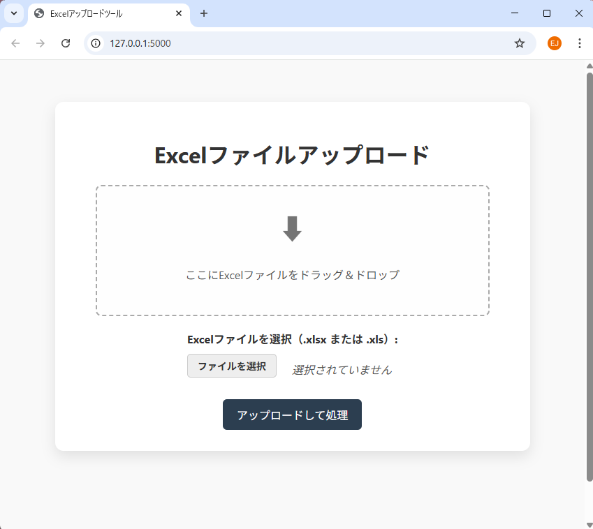
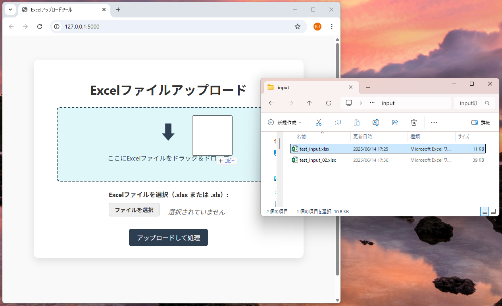
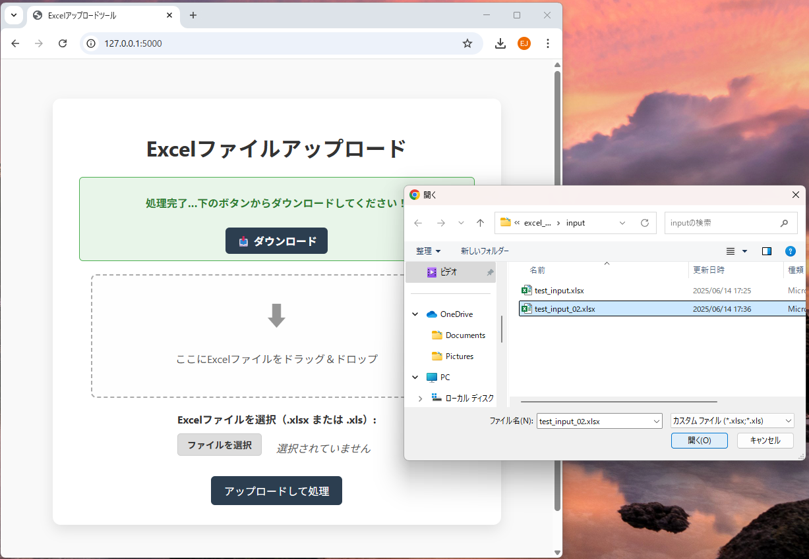
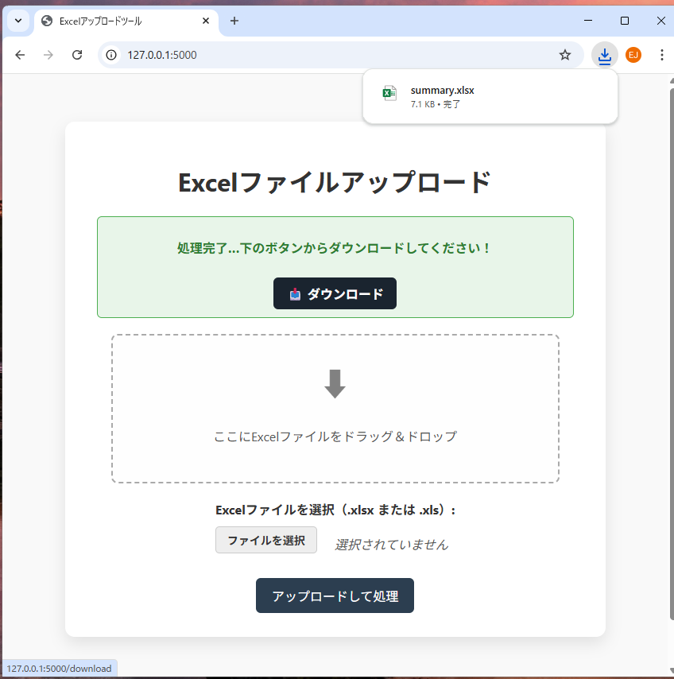
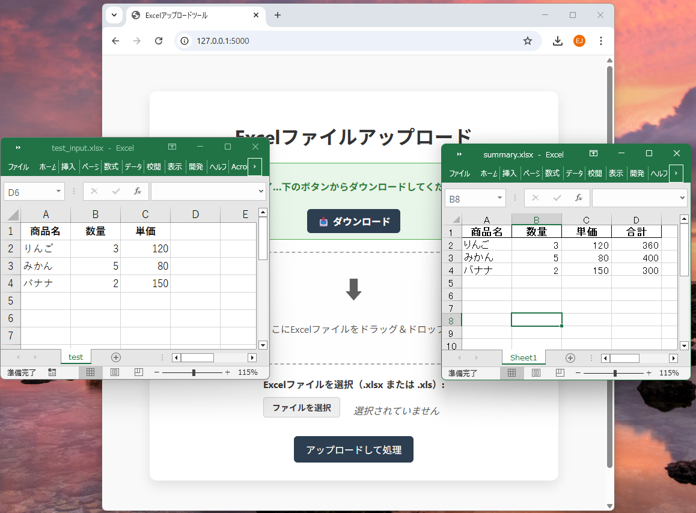

# Excel集計ツール（Flaskアプリ）

## 📌 アプリ概要

このアプリは、Excelファイルをアップロードし、pandasを使って簡易的な集計処理を行い、結果をダウンロードできるWebアプリです。

主に日本語環境・業務向け資料として、**ポートフォリオ用途**に最適化しています。

---

## ✨ 特徴（機能）

- ✅ Excelファイル（.xlsx / .xls）をアップロード
- ✅ pandasで集計処理（例：読み込み・保存など）
- ✅ **ドラッグ＆ドロップ対応 UI**
- ✅ **アップロード時に「処理中...」表示**
- ✅ 処理完了後はメッセージ表示＋ダウンロードボタン
- ✅ **GitHubでの動作エビデンス資料あり（Excel）**

---

## 🖼️ 画面イメージ

### 1.　初期画面（起動時）



### 2-1.ExcelFile ドラッグ＆ドロップ


### 2-2.ExcelFile ダイアログ選択


### 3. アップロードして処理


### 4. ダウンロード（処理後 ExcelFile）


### 5. 入出力 ExcelFile 結果



---

## ⚙️ 使用技術・ライブラリ

| 技術           | 説明                         |
|----------------|------------------------------|
| Python         | バックエンド（Flask）        |
| Flask          | 軽量Webフレームワーク        |
| pandas         | Excelデータの読み書き        |
| HTML / CSS     | UIのマークアップとデザイン  |
| JavaScript     | ドラッグ&ドロップ、表示制御  |

---

## 🚀 起動方法（ローカル開発）

<details>
<summary>クリックで展開</summary>

### ① 必要なライブラリをインストール

```bash
pip install flask pandas openpyxl
```
### ② アプリを起動

```bash
python excel_upload_tool.py
```
### ③ ブラウザでアクセス
```cpp
http://127.0.0.1:5000
```
</details>

## 📁 ディレクトリ構成

<details> <summary>クリックで展開</summary>

```cpp
excel_summary_app/
├── excel_upload_tool.py
├── templates/
│   └── index.html
├── static/
│   ├── style.css
│   └── script.js
├── uploads/           ← アップロードされたファイル
├── outputs/           ← 集計後の出力ファイル
└── READ.me            ← アプリ概要
```
</details>